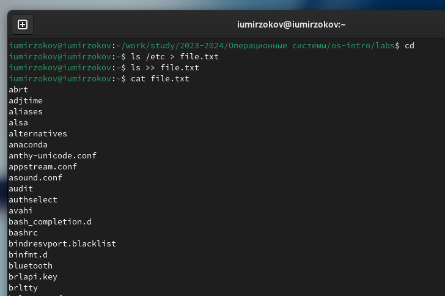
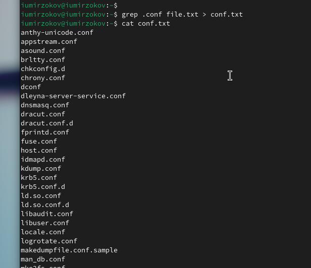
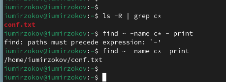
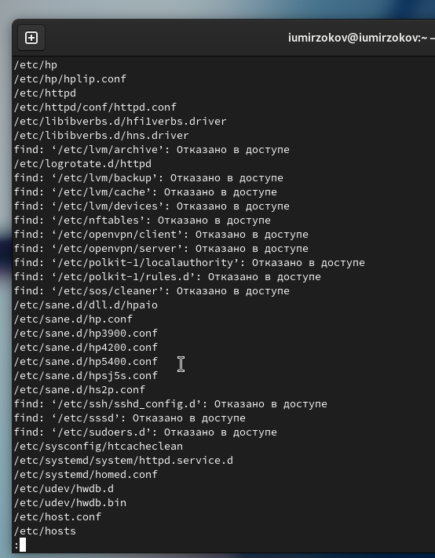
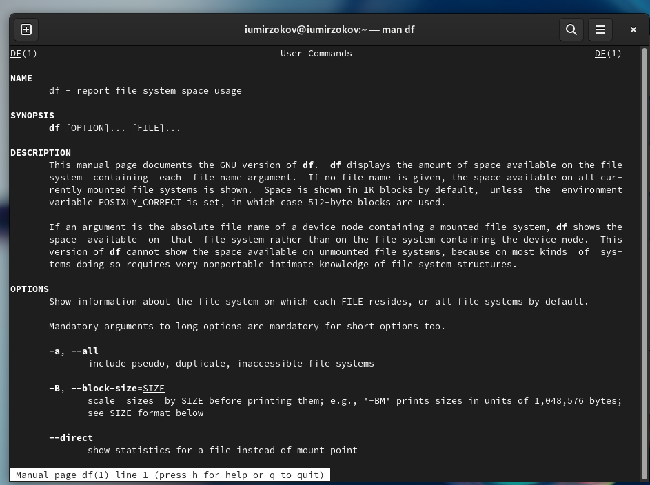
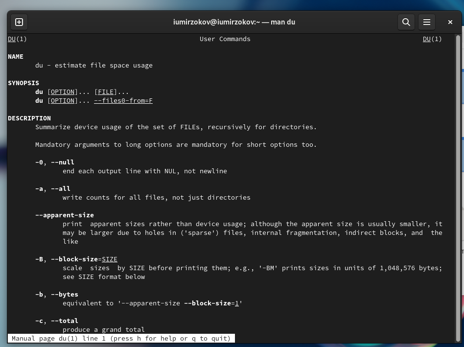
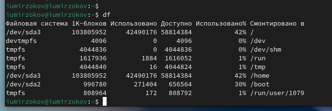
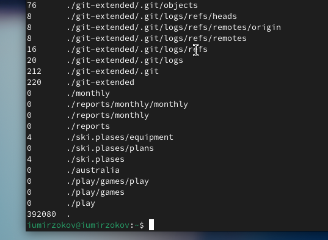

---
# Front matter
lang: ru-RU
title: "Отчёт по лабораторной работе №8"
subtitle: "Поиск файлов. Перенаправление ввода-вывода. Просмотр запущенных процессов"
author: "Умирзоков Иброхим Шомилжон угли"

# Formatting
toc-title: "Содержание"
toc: true # Table of contents
toc_depth: 2
lof: true # List of figures
fontsize: 12pt
linestretch: 1.5
papersize: a4paper
documentclass: scrreprt
polyglossia-lang: russian
polyglossia-otherlangs: english
mainfont: PT Serif
romanfont: PT Serif
sansfont: PT Sans
monofont: PT Mono
mainfontoptions: Ligatures=TeX
romanfontoptions: Ligatures=TeX
sansfontoptions: Ligatures=TeX,Scale=MatchLowercase
monofontoptions: Scale=MatchLowercase
indent: true
pdf-engine: lualatex
header-includes:
  - \linepenalty=10 # the penalty added to the badness of each line within a paragraph (no associated penalty node) Increasing the value makes tex try to have fewer lines in the paragraph.
  - \interlinepenalty=0 # value of the penalty (node) added after each line of a paragraph.
  - \hyphenpenalty=50 # the penalty for line breaking at an automatically inserted hyphen
  - \exhyphenpenalty=50 # the penalty for line breaking at an explicit hyphen
  - \binoppenalty=700 # the penalty for breaking a line at a binary operator
  - \relpenalty=500 # the penalty for breaking a line at a relation
  - \clubpenalty=150 # extra penalty for breaking after first line of a paragraph
  - \widowpenalty=150 # extra penalty for breaking before last line of a paragraph
  - \displaywidowpenalty=50 # extra penalty for breaking before last line before a display math
  - \brokenpenalty=100 # extra penalty for page breaking after a hyphenated line
  - \predisplaypenalty=10000 # penalty for breaking before a display
  - \postdisplaypenalty=0 # penalty for breaking after a display
  - \floatingpenalty = 20000 # penalty for splitting an insertion (can only be split footnote in standard LaTeX)
  - \raggedbottom # or \flushbottom
  - \usepackage{float} # keep figures where there are in the text
  - \floatplacement{figure}{H} # keep figures where there are in the text
---

# Цель работы

Ознакомление с инструментами поиска файлов и фильтрации текстовых данных. Приобретение практических навыков: по управлению процессами, по проверке  использования диска и обслуживанию файловых систем.

# Выполнение лабораторной работы

1 Включаем компьютер, и заходим в учетную запись.

2 Запишем в файл file.txt названия файлов, содержащихся в каталоге /etc. Допишем в этот же файл названия файлов, содержащихся в нашем домашнем каталоге. 

{ #fig:001 height=70% width=70% }

3 Выведем имена всех файлов из file.txt, имеющих расширение .conf, после чего запишем их в новый текстовой файл conf.txt. 

{ #fig:002 height=70% width=70% }

4 Определили, какие файлы в нашем домашнем каталоге имеют имена, начинавшиеся с символа c? 

{ #fig:003 height=70% width=70% }

5 Выведем на экран (постранично) имена файлов из каталога /etc, начинающиеся с символа h.

```
find /etc -name "h*" -print | less 
```

{ #fig:004 height=70% width=70% }

6 Запустили в фоновом режиме процесс, который будет записывать в 
файл ~/logfile файлы, имена которых начинаются с log. 
Процесс выполнен 

7 Удалили файл ~/logfile. Но сначала убили процесс в нем.

{ #fig:005 height=70% width=70% }

8 Запустили из консоли в фоновом режиме редактор gedit. 

9 Определили идентификатор процесса gedit, используя команду ps, конвейер и фильтр grep

10 Прочитали справку (man) команды kill, после чего используйте её для завершения процесса gedit. 

{ #fig:006 height=70% width=70% }

11 Выполним команды df и du, предварительно получив более подробную информацию об этих командах, с помощью команды man. 

{ #fig:007 height=70% width=70% }

{ #fig:008 height=70% width=70% }

{ #fig:009 height=70% width=70% }

{ #fig:010 height=70% width=70% }

12	Воспользовавшись справкой команды find, вывести имена всех директорий, имеющихся в нашем домашнем каталоге.

```
find ~ -type d
```

{ #fig:011 height=70% width=70% }

# Вывод

В данной работе мы ознакомились с инструментами поиска файлов и фильтрации текстовых данных. А также приобрели практические навыки по управлению процессами. 

# Контрольные вопросы

1. Какие потоки ввода вывода вы знаете?
Ответ: 
a) stdin — стандартный поток ввода (клавиатура),

b) stdout — стандартный поток вывода (консоль),

c) stderr — стандартный поток вывод сообщений об ошибках на экран

2. Объясните разницу между операцией > и >>
Ответ: 
Разница заключается в том, что Символ > используется для переназначения стандартного ввода команды, а символ >> используется для присоединения данных в конец файла стандартного вывода команды.

3. Что такое конвейер?
Ответ: Конвейер – это способ связи между двумя программами. 
Например: конвейер pipe служит для объединения простых команд или утилит в цепочки, в которых результат работы предыдущей команды передается последующей. 
Синтаксис у конвейера  следующий: команда1 | команда 2


4. Что такое процесс? Чем это понятие отличается от программы?
Ответ: Процесс - это программа, которая выполняется в отдельном виртуальном адресном пространстве независимо от других программ или их пользованию по необходимости. \

5. Что такое PID и GID?
Ответ: Во первых id — UNIX-утилита, выводящая информацию об указанном пользователе USERNAME или текущем пользователе, который запустил данную команду и не указал явно имя пользователя.
1)	GID – (Group ID) - идентификатор группы 
2)	UID – (User ID) - идентификатор группы
Обычно UID  является — положительным целым число м в диапазоне от 0 до 65535, по которому в системе однозначно отслеживаются действия пользователя

6. Что такое задачи и какая команда позволяет ими управлять?
Ответ: Запущенные фоном программы называются задачами(процессами) (jobs). Ими можно управлять с помощью команды jobs, которая выводит список запущенных в данный момент процессов. Для завершения процесса необходимо выполнить команду :
kill % номер задачи

7. Найдите информацию об утилитах top и htop. Каковы их функции?
Ответ: 
Top это консольная команда, которая выводит список работающих в системе процессов и информации о них. По умолчанию она в реальном времени сортирует их по нагрузке на процессор.Htop же является альтернативой программы top она предназначенная для вывода на терминал списка запущенных процессов и информации о них.

8. Назовите и дайте характеристику команде поиска файлов. Приведите примеры использования этой команды.
Ответ: Команда find используется для поиска и отображения имен файлов, соответствующих заданной строке символов.
Синтаксис: find trek [-options]
Пример:
Задача - Вывести на экран имена файлов из каталога /etc и его подкаталогов, Заканчивающихся на k:
find ~ -name "*k" -print

9. Можно ли по контексту (содержанию) найти файл? Если да, то как?
Ответ: Можно, команда grep способна обрабатывать вывод других файлов. Для этого надо использовать конвейер, связав вывод команды с вводом grep.
Пример:
Задача - показать строки в каталоге /dreams с именами начинающимися на t, в которых есть фраза:  I like of Operating systems
grep I like of Operating systems t*

10. Как определить объем свободной памяти на жёстком диске?
Ответ:
Команда df показывает размер каждого смонтированного раздела диска.
Например команда: df -h

11. Как определить объем вашего домашнего каталога?
Ответ: Команда du показывает число килобайт, используемое каждым файлом или каталогом.
Например команда: du -sh

12. Как удалить зависший процесс?
Ответ: Перед тем, как выполнить остановку процесса, нужно определить его PID. Когда известен PID , мы можем убить его командой kill. Команда kill принимает в качестве параметра PID процесса. 
PID можно узнать с помощью команд ps, grep, top или htop

